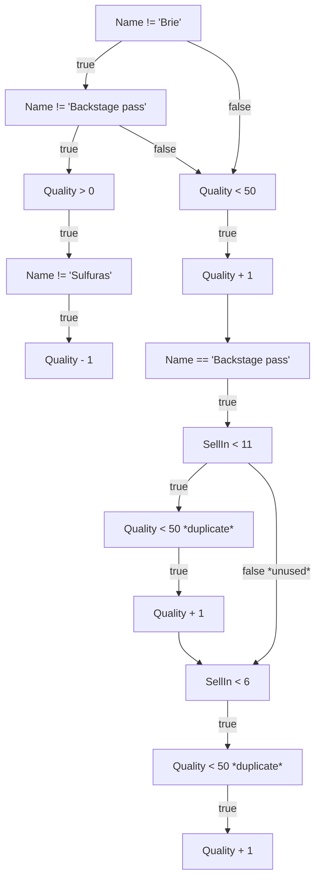
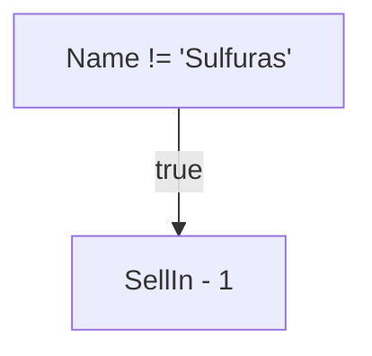
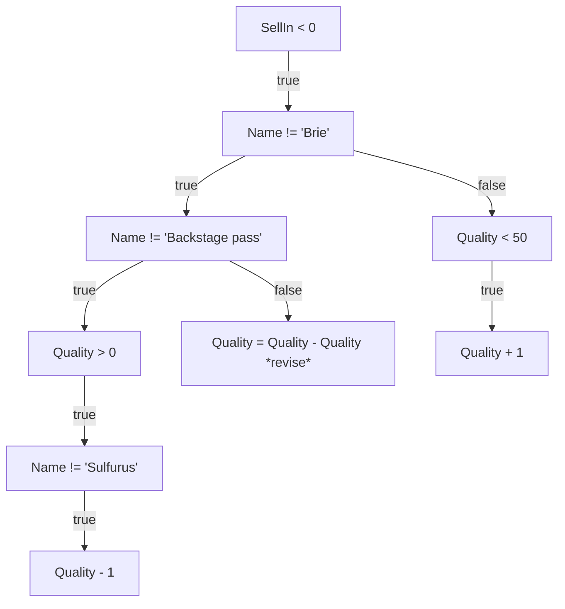

# Mermaid Flowchart Graph

Below is group 18's GildedRose assignment-05.

We have decidede to refactor the Item class (and angry the Goblin in the corner), because this was the only way we could avoid code duplication while following good software engineering principles.

We have made Item an abstract class and implemented the abstract method `Update()` and a `SellIn()` method.  
This way, each type of item can implement their own logic when updating the `Quality` and `SellIn` properties, i.e. Sulfuras not updating its `SellIn` property at all.  
This also means, that introducing a new type of Item just requires the developer to add a new class that extends the abstract `Item` class and implement the `Update()` logic that the new item type requires.

## Flowcharts

Below three flowcharts were created during the analysis phase of the assignment, where we one step at a time looked through the code and refactored it into a simple Flowchart diagram (which does not 100% follow the standards, but is plentiful for our own internal use).

This means that creating testcases, we could look away from the code but instead at the logic in the below three flowcharts - and the same goes when refactoring the code afterwards.

### Item Quality

### Item SellIn

### SellIn < 0

