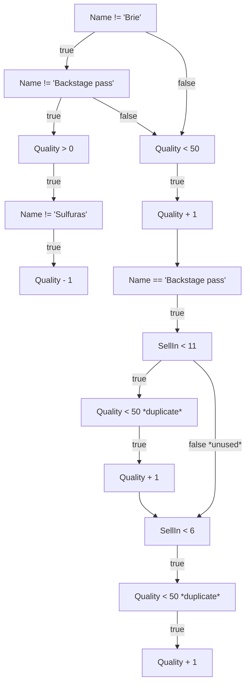
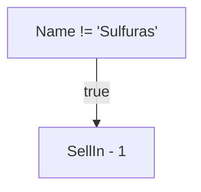
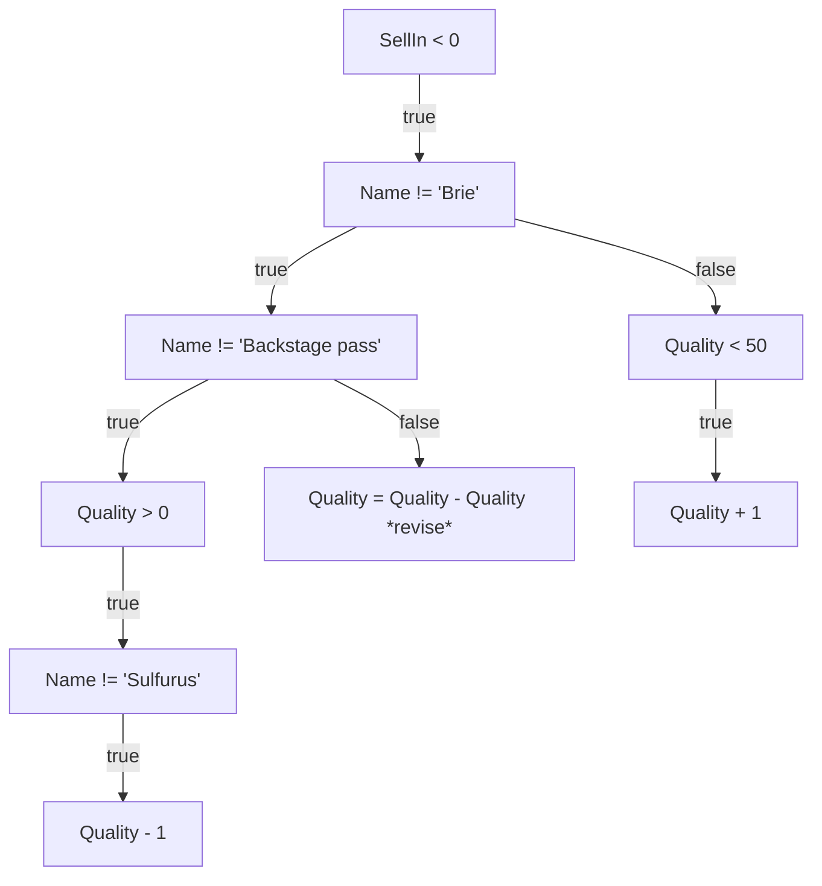

# Mermaid Flowchart Graph

## Item Quality

```mermaid
graph TD
    A[Name != 'Brie'] --true--> B[Name != 'Backstage pass']
    A --false--> C[Quality < 50]
    B --false--> C
    B --true--> D[Quality > 0]
    D --true--> E[Name != 'Sulfuras']
    E --true--> F[Quality - 1]
    C --true--> G[Quality + 1]
    G --> H[Name == 'Backstage pass']
    H --true--> I[SellIn < 11]
    I --true--> J[Quality < 50 *duplicate*]
    J --true--> K[Quality + 1]
    I --false *unused*--> L[SellIn < 6]
    K --> L
    L --true--> M[Quality < 50 *duplicate*]
    M --true--> N[Quality + 1]
```

## Item SellIn

```mermaid
graph TD
    A[Name != 'Sulfuras'] --true--> B[SellIn - 1] 
```

## SellIn < 0

```mermaid
graph TD
    A[SellIn < 0] --true--> B[Name != 'Brie']
    B --true--> C[Name != 'Backstage pass']
    C --true--> D[Quality > 0]
    D --true--> E[Name != 'Sulfurus']
    E --true--> F[Quality - 1]
    C --false--> G[Quality = Quality - Quality *revise*]
    B --false--> H[Quality < 50]
    H --true--> I[Quality + 1]
```
